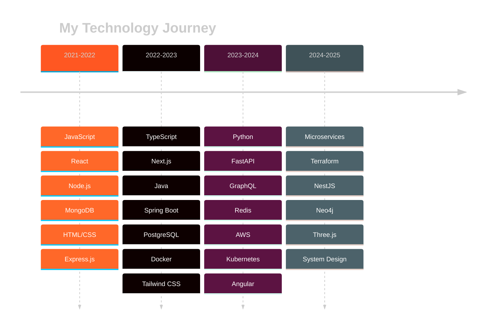

<div align="center">

<!-- Animated Header -->


<!-- Typing Animation -->
<p align="center">
  
</p>

<!-- Animated Badges -->
<p align="center">
  
  
  
  
</p>

<!-- Social Links with Hover Effects -->
<p align="center">
  <a href="https://linkedin.com/in/ahmeddhib">
    
  </a>
  <a href="https://twitter.com/ahmed_dhib">
    
  </a>
  <a href="https://ahmeddhib.dev">
    
  </a>
  <a href="mailto:contact@ahmeddhib.dev">
    
  </a>
  <a href="https://blog.ahmeddhib.dev">
    
  </a>
  <a href="https://leetcode.com/ahmeddhib">
    
  </a>
</p>

</div>

---

## 👨‍💻 About Me

```typescript
const ahmed = {
    role: "Full Stack Developer",
    experience: "3+ years",
    location: "Tunis, Tunisia 🇹🇳",
    passion: "Transforming complex problems into elegant solutions",
    philosophy: "Clean code is not written by following rules. It's written by someone who cares.",
    
    currentFocus: [
        "Building scalable web applications",
        "Exploring cloud architecture",
        "Contributing to open source",
        "Learning new technologies"
    ],
    
    funFact: "I can debug code faster than I can find my keys! 🔑"
};
```

<details open>
<summary><b>🎯 Quick Stats</b></summary>
<br>

- 🔭 Currently working on **Microservices Architecture**
- 🌱 Learning **Kubernetes & AWS Advanced Services**
- 👯 Looking to collaborate on **Open Source Projects**
- 💬 Ask me about **React, Node.js, TypeScript, System Design**
- ⚡ Fun fact: **I've visited 15+ countries for tech conferences**

</details>

---

## 🛠️ Tech Arsenal

<details open>
<summary><b>🎨 Frontend Development</b></summary>
<br>

<p align="center">
  
</p>

<p align="center">
  
  
  
  
  
  
  
  
</p>

</details>

<details open>
<summary><b>⚙️ Backend Development</b></summary>
<br>

<p align="center">
  
</p>

<p align="center">
  
  
  
  
  
  
  
  
</p>

</details>

<details open>
<summary><b>💾 Databases & Caching</b></summary>
<br>

<p align="center">
  
</p>

<p align="center">
  
  
  
  
  
  
</p>

</details>

<details open>
<summary><b>☁️ DevOps & Cloud</b></summary>
<br>

<p align="center">
  
</p>

<p align="center">
  
  
  
  
  
  
  
  
</p>

</details>

<details open>
<summary><b>🔧 Tools & Others</b></summary>
<br>

<p align="center">
  
</p>

<p align="center">
  
  
  
  
  
  
  
  
</p>

</details>

---

## 📊 GitHub Statistics

<div align="center">
  
  
</div>

<div align="center">
  
  
</div>

<!-- Activity Graph -->


---

## 🏆 GitHub Trophies

<div align="center">
  
</div>

---

## 📈 Coding Activity & Stats

<div align="center">

### 💻 Weekly Development Breakdown

<!--START_SECTION:waka-->
```text
TypeScript   ████████████████▓░░░░░   68.2%  🔥 Primary Language
JavaScript   ██████████░░░░░░░░░░░░   42.5%  ⚡ Active Development  
Java         ████████░░░░░░░░░░░░░░   28.7%  🎯 Backend Focus
Python       ██████░░░░░░░░░░░░░░░░   22.3%  🐍 Growing Expertise
HTML/CSS     ████░░░░░░░░░░░░░░░░░░   15.8%  🎨 UI/UX Work
Docker       ███░░░░░░░░░░░░░░░░░░░   12.4%  🐳 DevOps Integration
SQL          ██░░░░░░░░░░░░░░░░░░░░    8.6%  💾 Data Management
YAML         █░░░░░░░░░░░░░░░░░░░░░    4.2%  ⚙️ Configuration
```
<!--END_SECTION:waka-->

### 🎯 Skill Proficiency Matrix

| 💻 Technology | 📊 Level | 🎯 Experience | 📁 Projects | 🔥 Status |
|:-------------|:---------|:-------------|:-----------|:----------|
| TypeScript |  | 2.5 years | 12 projects | 🚀 Expert Track |
| JavaScript |  | 3+ years | 18 projects | ⭐ Mastered |
| React |  | 3+ years | 14 projects | ⭐ Mastered |
| Node.js |  | 2.5 years | 10 projects | 🚀 Expert Track |
| Java |  | 2 years | 8 projects | 📈 Growing |
| Python |  | 1.5 years | 6 projects | 📚 Learning |
| AWS |  | 1 year | 5 projects | 📚 Learning |
| Docker |  | 1.5 years | 9 projects | 📈 Growing |

</div>

---

## 🚀 Featured Projects

<div align="center">

<table>
<tr>
<td width="50%">

### 🛒 E-Commerce Platform

<a href="https://pack-dashboard.vercel.app/shop">
  
</a>
<a href="https://github.com/Ahmed.dhib/ecommerce-platform">
  
</a>

**Full-featured e-commerce solution** with real-time inventory management, secure payment processing via Stripe, comprehensive admin dashboard, and responsive design.

**Tech Stack:**
- `Next.js 14` - React Framework
- `TypeScript` - Type Safety
- `MongoDB` - Database
- `Stripe` - Payments
- `Tailwind CSS` - Styling

**Features:**
- 🛍️ Product Management System
- 💳 Secure Payment Gateway
- 📊 Real-time Analytics Dashboard
- 🔐 Authentication & Authorization
- 📱 Fully Responsive Design


</td>
<td width="50%">

### 💬 Real-Time Chat Application

<a href="https://github.com/Ahmeddhib/chat-app">
  
</a>
<a href="https://github.com/Ahmed.dhib/chat-app">
  
</a>

**WebSocket-based messaging platform** with real-time communication, typing indicators, message history, and group chat functionality.

**Tech Stack:**
- `Socket.io` - Real-time Engine
- `React` - Frontend Framework
- `Node.js` - Backend Runtime
- `Redis` - Session Management
- `Docker` - Containerization

**Features:**
- 💬 Real-time Messaging
- 👥 Group Chats
- 📝 Typing Indicators
- 📎 File Sharing
- 🔔 Push Notifications


</td>
</tr>

<tr>
<td width="50%">

### 📋 Task Management System

<a href="https://github.com/Ahmeddhib/task-manager">
  
</a>
<a href="https://github.com/Ahmeddhib/task-manager">
  
</a>

**Enterprise-grade task management** with team collaboration tools, project tracking, sprint planning, and comprehensive analytics dashboard.

**Tech Stack:**
- `Angular` - Frontend Framework
- `Spring Boot` - Backend Framework
- `PostgreSQL` - Relational DB
- `Docker` - Deployment
- `JWT` - Authentication

**Features:**
- 📊 Kanban Boards
- 🎯 Sprint Planning
- 👥 Team Collaboration
- 📈 Progress Analytics
- ⏰ Time Tracking


</td>
<td width="50%">

### 🎮 More Projects Coming Soon!


Working on exciting new projects including:

- 🤖 **AI-Powered Code Assistant**
- 🌐 **Social Media Platform**
- 📱 **Mobile Banking App**
- 🎨 **Design System Library**

**What's Next:**
- Microservices Architecture
- Machine Learning Integration
- Progressive Web Apps
- Real-time Collaboration Tools

Stay tuned for updates! 🚀


</td>
</tr>
</table>

</div>

---

## 🎯 Development Philosophy

<div align="center">

```javascript
class Developer {
  constructor() {
    this.name = "Ahmed Dhib";
    this.role = "Full Stack Developer";
    this.location = "Tunis, Tunisia";
  }

  principles = {
    code: "Write code that humans can read",
    testing: "Test first, deploy with confidence",
    documentation: "Code tells how, comments tell why",
    collaboration: "Knowledge shared is knowledge squared",
    learning: "Stay curious, stay humble"
  };

  dailyRoutine = async () => {
    await this.drinkCoffee();
    while (this.isAwake) {
      await this.code();
      await this.debug();
      await this.learnSomethingNew();
      await this.repeat();
    }
  };

  lifeGoals = [
    "Create impact through technology",
    "Contribute to open source",
    "Mentor aspiring developers",
    "Build products people love"
  ];
}

const ahmed = new Developer();
ahmed.dailyRoutine();
```

> ### 💭 Favorite Quotes
> 
> *"First, solve the problem. Then, write the code."* - John Johnson
> 
> *"Code is like humor. When you have to explain it, it's bad."* - Cory House
> 
> *"Make it work, make it right, make it fast."* - Kent Beck

</div>

---

## 📚 Learning Journey

<details open>
<summary><b>🎓 Currently Learning (2024-2025)</b></summary>
<br>

<table>
<tr>
<td width="25%" align="center">
  
  <br><b>Kubernetes</b>
  <br>Container Orchestration
  <br>
</td>
<td width="25%" align="center">
  
  <br><b>AWS Advanced</b>
  <br>Cloud Architecture
  <br>
</td>
<td width="25%" align="center">
  
  <br><b>Terraform</b>
  <br>Infrastructure as Code
  <br>
</td>
<td width="25%" align="center">
  
  <br><b>Three.js</b>
  <br>3D Web Graphics
  <br>
</td>
</tr>
<tr>
<td width="25%" align="center">
  
  <br><b>NestJS</b>
  <br>Enterprise Backend
  <br>
</td>
<td width="25%" align="center">
  
  <br><b>GraphQL</b>
  <br>API Development
  <br>
</td>
<td width="25%" align="center">
  
  <br><b>Neo4j</b>
  <br>Graph Database
  <br>
</td>
<td width="25%" align="center">
  
  <br><b>Rust</b>
  <br>Systems Programming
  <br>
</td>
</tr>
</table>

</details>

<details>
<summary><b>🌟 Technology Evolution Timeline</b></summary>
<br>



</details>

---

## ✨ Fun Facts & Interests

<div align="center">

<table>
<tr>
<td width="33%" align="center">
  
  <h4>🌐 Open Source</h4>
  <p>Active contributor to <b>5+</b> projects<br>Passionate about community collaboration</p>
</td>
<td width="33%" align="center">
  
  <h4>🎮 Game Development</h4>
  <p>Created <b>2 games</b> with Unity & Godot<br>Love building interactive experiences</p>
</td>
<td width="33%" align="center">
  
  <h4>🎸 Music</h4>
  <p>Plays guitar and piano<br>Composes music in free time</p>
</td>
</tr>
<tr>
<td width="33%" align="center">
  
  <h4>✈️ Travel</h4>
  <p>Visited <b>15+ countries</b><br>Attended global tech conferences</p>
</td>
<td width="33%" align="center">
  
<invoke name="artifacts">
<parameter name="command">update</parameter>
<parameter name="id">github_profile_readme</parameter>
<parameter name="old_str"><td width="33%" align="center">

<parameter name="new_str"><td width="33%" align="center">

  <h4>📚 Reading</h4>
  <p>Reads <b>20+</b> tech books annually<br>Continuous learner and knowledge seeker</p>
</td>
<td width="33%" align="center">
  
  <h4>☕ Coffee Enthusiast</h4>
  <p>Can distinguish <b>10+</b> coffee varieties<br>Fuel for coding marathons</p>
</td>
</tr>
</table>
🎯 Quick Facts

🏆 Completed 42+ personal projects
🔥 120 day longest GitHub streak
💡 1,500+ commits in the last year
🌍 Contributed to projects from 10+ countries
🚀 Deployed 15+ production applications
📝 Written 50+ technical blog posts

</div>

📞 Let's Connect!
<div align="center">
<p align="center">
  <i>Open to opportunities and collaborations</i>
</p>
<p align="center">
  <a href="https://linkedin.com/in/ahmeddhib">
    
  </a>
  <a href="mailto:contact@ahmeddhib.dev">
    
  </a>
  <a href="https://ahmeddhib.dev">
    
  </a>
</p>
<p align="center">
  <a href="https://twitter.com/ahmed_dhib">
    
  </a>
  <a href="https://blog.ahmeddhib.dev">
    
  </a>
  <a href="https://leetcode.com/ahmeddhib">
    
  </a>
</p>
💬 Ask Me About
<p align="center">
  
  
  
  
  
  
</p>
</div>

📈 Contribution Snake
<div align="center">
Afficher l'image
</div>

<div align="center">
💭 Random Dev Quote
Afficher l'image
😂 Dev Humor


📊 Profile Statistics
<p align="center">
  
</p>
<p align="center">
  
  
</p>
<p align="center">
  
  
</p>

javascript// Final Message
const message = {
  thanks: "Thanks for visiting my profile! 🙏",
  collaboration: "Always open to interesting projects and collaborations",
  contact: "Feel free to reach out - let's build something amazing together! 🚀",
  
  farewell: function() {
    console.log(`${this.thanks}`);
    console.log(`${this.collaboration}`);
    console.log(`${this.contact}`);
    console.log("Happy Coding! 💻✨");
  }
};

message.farewell();
<p align="center">
  
</p>
<p align="center">
  <sub>⭐ From <a href="https://github.com/Ahmeddhib">Ahmed Dhib</a> with ❤️</sub>
  <br>
  <sub>✨ Dynamically generated with passion and code</sub>
</p>
</div></parameter>
